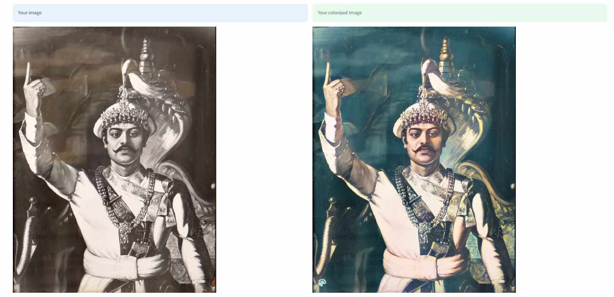

# Image Colorization using Deep Learning (GANs)

## Overview
This project aims to automatically colorize grayscale images using Deep Learning techniques, specifically Generative Adversarial Networks (GANs). Image colorization is a fascinating problem in computer vision, and with the advancements in deep learning, it has become possible to automate this process effectively.

## Features
- **Automatic Colorization:** The model automatically adds color to grayscale images without any manual intervention.
- **Generative Adversarial Network (GAN):** Utilizes a GAN architecture to generate realistic and vibrant colors for grayscale images.
- **Customizable:** The model architecture and hyperparameters are customizable to adapt to different datasets and requirements.
- **Easy-to-use Interface:** The provided scripts and code are easy to understand and can be used by both beginners and experts.

## Requirements
- Python (>=3.6)
- TensorFlow (>=2.0)
- OpenCV
- NumPy
- Matplotlib

## Usage
1. **Data Preparation:** Prepare your dataset of grayscale images along with their corresponding color images. Ensure that the images are of the same size and format.
2. **Data Preprocessing:** Preprocess your dataset as necessary, including resizing, normalization, and splitting into training and validation sets.
3. **Training:** Train the GAN model using the provided script. Adjust the hyperparameters as needed to achieve better performance.
4. **Evaluation:** Evaluate the trained model on the validation set to assess its performance in terms of colorization accuracy and visual quality.
5. **Inference:** Use the trained model to colorize grayscale images. You can either use the provided script or integrate the model into your application.

